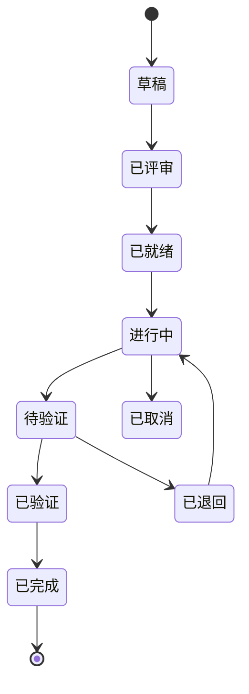

# Agent Workspace 组织规范

## 目录

- [第一部分：全局规范](#第一部分全局规范)（所有 Agent 必须遵守）
- [第二部分：BA Agent 工作流](#第二部分ba-agent-工作流)
- [第三部分：Dev Agent 工作流](#第三部分dev-agent-工作流)
- [第四部分：QA Agent 工作流](#第四部分qa-agent-工作流)
- [第五部分：Deploy Agent 工作流](#第五部分deploy-agent-工作流)

---

# 第一部分：全局规范

## 核心设计：workspace 根容器 + 物理平铺

整个 workspace 由一个 **`workspace` 分支** 作为根容器。仓库根（clone 默认落点）= `workspace` 分支的 worktree，**只跟踪两个文件**：`README.md` + `.gitignore`。

所有其他 worktree（`code/`、`BA/`、`Deploy/`、`feature-REQ-xxx/`、`hotfix-xxx/`）**直接在仓库根平铺**，跟 `README.md` 同级，互为兄弟目录。

**为什么这么设计**：

- 仓库根就是"workspace 容器"，git 默认 clone 落点有合法分支身份
- 所有 worktree 物理平铺，**没有 worktree 嵌套**、没有中间目录层
- 视觉最清晰：`ls` 一下看到 `code/ BA/ Deploy/ feature-xxx/ hotfix-xxx/` 全在第一层
- 解决"平台运行目录锁定 + worktree 嵌套"问题：平台目录 = 仓库根，所有 worktree 在它下面平铺

> **硬约束（必读）**：
> 1. `workspace` 分支**只跟踪 `README.md` + `.gitignore`**（`git ls-files` 必须只有这两个文件）
> 2. `.gitignore` 使用**双层防御机制**：
>    - **白名单层**：先 `*` 全忽略 + `!*/` 保留目录遍历 + `!.gitignore` `!README.md` 显式白名单
>    - **`/*/` 屏蔽层**：忽略所有第一层子目录（worktree 都在第一层）
>    - 目的：worktree 目录（`code/` `BA/` `Deploy/` 等）是 embedded git repos，内部有 `.git` file，
>      如果只靠白名单，`!*/` 会让 git 遍历这些目录，可能误 add 或显示 untracked
>    - `/*/` 从源头阻止任何 worktree 内部文件进入 workspace 分支（详见 `templates/root-gitignore.tpl`）
> 3. `workspace` 分支**禁止业务代码**（src/、tests/、package.json、CI 配置等）
> 4. **禁止 worktree 嵌套**：所有 worktree 必须在仓库根第一层，**不允许中间目录层**（如 `workspaces/code/`）
> 5. **其他 worktree 各自管各自的 `.gitignore`**：
>    - `code/.gitignore` 由 develop 分支跟踪
>    - `BA/.gitignore` 由 demand 分支跟踪（如需要）
>    - `Deploy/.gitignore` 由 deploy 分支跟踪（如需要）
>    - `feature-xxx/.gitignore` 由 feature 分支跟踪（如需要）
>    - workspace 分支**一概不管**其他 worktree 内部的 ignore 规则
>
> **关于"无父的独立分支"**：`workspace` / `demand` / `deploy` 这三个分支是互相无父的 orphan 分支，
> 各自完整地管理自己的 `.gitignore`，互不依赖。这是 git 工作流中典型的"多根分支"模式。
>
> BA Agent 启动时必须做 workspace 巡检，发现违规立即清理（详见 `lifecycle/worktree-audit.md`）。

## 目录结构

```
<project-root>/                        # workspace 分支 worktree（仓库根容器）
├── README.md                            # workspace 分支跟踪：项目导航
├── .gitignore                           # workspace 分支跟踪：白名单防御机制
├── .git/                                # 仓库元数据
│
├── code/                                # [worktree] develop 分支 - CI 主工作区
│   └── .gitignore                       #   develop 分支跟踪（业务相关 ignore）
├── BA/                                  # [worktree] demand 分支 - 需求管理
│   └── .gitignore                       #   demand 分支跟踪（可选）
├── Deploy/                              # [worktree] deploy 分支 - 部署配置
│   └── .gitignore                       #   deploy 分支跟踪（可选）
│
├── feature-REQ-xxx/                     # [worktree] feature/REQ-xxx 分支 - 需求开发
│   └── .gitignore                       #   feature 分支跟踪（如需要）
└── hotfix-xxx/                          # [worktree] hotfix/xxx 分支 - 紧急修复
    └── .gitignore                       #   hotfix 分支跟踪（如需要）
```

**所有 worktree 在仓库根平铺**，没有中间目录层、没有 worktree 嵌套。
**每个 worktree 内部的 `.gitignore` 由对应工作分支跟踪**（无父的独立分支各自管各自的）。

## 分支策略

| 分支 | 用途 | 谁写入 | 基分支 |
|------|------|--------|--------|
| `workspace` | **根容器**——仓库根目录的归属分支，只跟踪 README.md + .gitignore | BA Agent（极少） | — |
| `develop` | 主开发分支，CI 构建 | 合并不直接写 | `main` |
| `demand` | 需求管理 | BA Agent | —（orphan，与 workspace/deploy 同级） |
| `feature/REQ-xxx` | 需求开发 | Dev Agent | `develop` |
| `deploy` | 部署配置 | Deploy Agent / CI | —（orphan，不与 main 合并） |
| `main` | 生产发布标记 | 仅从 release 合并 | — |
| `release/vx.y.z` | 预发布 | 发布管理员 | `develop` |
| `hotfix/xxx` | 紧急修复 | Dev Agent | `main` |

**workspace 分支的硬约束**：

- ✅ 只跟踪 `README.md` + `.gitignore`（两个文件）
- ✅ `.gitignore` 使用**双层防御**：白名单（`!README.md` + `!.gitignore` + `*` + `!*/`）+ `/*/` 屏蔽所有第一层子目录
- ✅ 更新由 BA Agent 手动 commit，commit message 格式 `[Workspace] {描述}`
- ❌ 禁止业务代码（src/、tests/、业务配置等）
- ❌ 禁止接收 PR（任何 feature → workspace 的 PR 都应拒绝）
- ❌ 禁止与 develop / main 互相合并
- ✅ 其他 worktree 的 `.gitignore` **由对应工作分支管理**（workspace 一概不管）

## 命名规范

- **需求编号**: `REQ-{三位数字}`，如 `REQ-001`
- **分支名**: `feature/REQ-001`, `hotfix/JIRA-123`
- **Worktree 目录**: `feature-REQ-001`, `hotfix-JIRA-123`（在仓库根平铺）
- **Commit Message**: `[{区域}] {描述} (关联: {需求ID})`
- **镜像 Tag**: 默认 `{GIT_SHA}`，发布用 `{GIT_TAG}`，特殊可用户指定

## 工作区定位规则

| Agent | 工作区 |
|-------|--------|
| BA Agent | `BA/` 目录（仓库根平铺） |
| Dev Agent | `feature-REQ-xxx/` 目录（由 BA Agent 分配） |
| QA Agent（Pre-merge） | `feature-REQ-xxx/` 目录 |
| QA Agent（Post-merge） | `code/` 目录 + staging 环境 |
| Deploy Agent | `Deploy/` 目录 |
| **Workspace 巡检** | **仓库根（workspace 工作区）**——BA Agent 启动时必做 |

> **路径基准约定**：所有 worktree 操作路径都从仓库根出发。
> 例：在仓库根跑 `git worktree add feature-REQ-001 -b feature/REQ-001 develop`
> 例：在 `BA/` worktree 里跑 `git worktree add ../feature-REQ-001 -b feature/REQ-001 develop`（`../` 回到仓库根）

## 初始化

### 新建项目

详见 `init/new-project.md`。核心步骤：

```bash
mkdir my-project && cd my-project
git init
git commit --allow-empty -m "[Init] workspace root"
git branch -m workspace                # 把默认分支改名为 workspace
# 写 README.md + .gitignore（用 templates/root-readme.md.tpl + templates/root-gitignore.tpl）
cp <skill-path>/templates/root-readme.md.tpl README.md
cp <skill-path>/templates/root-gitignore.tpl .gitignore
git add README.md .gitignore && git commit -m "[Workspace] 初始化导航 + 白名单 .gitignore"
# 创建主分支
# main 为生产分支（orphan 独立），develop 从 main 派生
git checkout --orphan main
git rm -rf . 2>/dev/null || true
echo "# {项目名称}" > README.md
git add README.md
git commit -m "[Init] main branch placeholder"
# develop 从 main 派生，共享历史
git checkout -b develop main
# demand 和 deploy 为 orphan 独立分支（管理与代码隔离）
git checkout workspace
git checkout --orphan demand
git rm -rf . 2>/dev/null || true
mkdir -p demands backlog sprint decisions dispatch
echo "# 需求管理分支" > README.md
git add README.md
git commit -m "[Init] 初始化需求管理分支"
git checkout workspace
git checkout --orphan deploy
git rm -rf . 2>/dev/null || true
mkdir -p apps environments releases scripts
echo "# 部署配置分支" > README.md
git add README.md
git commit -m "[Init] 初始化部署分支"
git checkout workspace
# 在仓库根平铺创建 worktree
git worktree add code develop
git worktree add BA demand
git worktree add Deploy deploy
# 推送到远程
git remote add origin <url>
git push -u origin workspace main develop demand deploy
```

### 已有项目迁移

详见 `init/migrate-project.md`。核心原则：**保历史、不动 commit hash、新建 workspace 分支作为新默认**。

6 步法骨架：

1. **备份**：`git clone --mirror` 兜底
2. **建 workspace 分支**：`--orphan workspace` + 空 commit + 写 README
3. **把现有 worktree 移到仓库根平铺**（如果有嵌套则拍平）
4. **创建 BA / Deploy 分支**（如果还没有）
5. **改远程默认分支** → workspace；改 CI checkout 策略
6. **验证**

---

# 第二部分：BA Agent 工作流

## 前置依赖

你位于 `BA/` 目录（`demand` 分支的 worktree），跟 `code/` `Deploy/` 在仓库根平铺。
所有变更通过 Git 持久化。
BA Agent 启动时**必须**额外做一次 workspace 巡检（见 `lifecycle/worktree-audit.md` 末节）。

## 核心职责

1. 需求管理：创建/维护需求文档
2. 迭代管理：维护迭代计划
3. 调度管理：维护 Agent 注册表
4. 状态跟踪：更新需求状态
5. Worktree 管理：创建/回收 worktree
6. 验证审批：确认验证结果
7. **workspace 分支维护**：必要时更新 `workspace/README.md`（新增 worktree 类型、升级规范等）

## BA/ 目录结构

```
BA/
├── README.md
├── demands/
│   ├── REQ-001-xxx/
│   │   ├── demand.md              # 需求描述
│   │   ├── acceptance.md          # 验收标准
│   │   ├── design-summary.md      # 设计概要
│   │   ├── status.md              # 当前状态
│   │   └── test-cases/            # 测试用例（QA 创建）
│   ├── REQ-002-xxx/
│   └── _template/
├── backlog/
│   ├── inbox/                     # 未梳理的原始想法
│   └── refined/                   # 已梳理待排期
├── sprint/
│   ├── current.md                 # 当前迭代计划
│   └── retrospective.md
├── decisions/                     # 架构决策记录 (ADR)
├── dispatch/
│   ├── rules.md                   # 调度规则
│   ├── registry.md                # Agent 注册表
│   ├── verification-queue.md      # 待验证队列
│   └── cleanup-log.md             # 回收日志
└── .ba/                           # 私有工作目录
```

## 需求状态流转



## 分配需求流程

```
1. 确认需求状态为"已就绪"
2. 从 dispatch/rules.md 查找可用的 Dev Agent
3. 创建 feature worktree（在仓库根跑）：
   cd <repo-root>
   git worktree add feature-REQ-001 -b feature/REQ-001 develop
4. 在 .feature/manifest.json 中记录分配信息
5. 更新需求状态为"进行中"
6. 创建 QA 子 agent 生成测试用例
7. 创建 Dev 子 agent 进行开发
```

## 验证审批流程

Dev 开发完成后，BA Agent 负责状态更新和 QA 调度，Dev 不直接更新状态。

```
1. Dev Agent 通知 BA 开发完成
2. BA 更新需求状态为"待验证"
3. BA 创建 QA 子 agent，依据测试用例进行代码审核
4. QA 审核完成，报告结果给 BA
5. BA 根据审核结果更新状态：
   → 通过：status.md → "已验证"
   → 不通过：status.md → "已退回"（附退回原因）
6. 状态为"已验证"后，通知 Dev 创建 PR
```

**关键规则**：
- 状态更新**仅由 BA Agent 执行**，Dev 和 QA 不直接修改 status.md
- Dev 只负责编码和自验证，完成时通知 BA
- QA 只负责审核和报告，不修改状态

## 创建子 agent 的方式

使用 `agent` 工具创建子 agent。将 skill 文件中对应角色的工作流作为 prompt 注入：

```python
# 创建 QA 子 agent（生成测试用例）
agent(
    action="start",
    type="verifier",
    prompt=f"""
    你是一个 QA Agent。以下是你的工作规范：
    
    {读取 agent-workspace 中 QA Agent 工作流部分}
    
    当前任务：为 REQ-xxx 生成测试用例
    工作区：BA/demands/REQ-xxx/
    """
)

# 创建 Dev 子 agent
agent(
    action="start",
    type="builder",
    write_roots=["feature-REQ-xxx"],
    prompt=f"""
    你是一个 Dev Agent。以下是你的工作规范：
    
    {读取 agent-workspace 中 Dev Agent 工作流部分}
    
    当前任务：实现 REQ-xxx
    工作区：feature-REQ-xxx/
    """
)
```

## 巡检兜底

每次启动时执行一次 worktree 巡检（详见 `lifecycle/worktree-audit.md`）：

1. 扫描所有 `feature-*` 和 `hotfix-*` worktree
2. 检查分支状态
3. 已合并但未清理的 → 执行清理
4. 记录到 `BA/dispatch/cleanup-log.md`

**额外：workspace 巡检**（详见 `lifecycle/worktree-audit.md` 末节）：

- 切到仓库根（workspace/ 工作区）
- `git ls-files` 必须只有 `README.md` + `.gitignore`（两个文件）
- 任何额外文件都属违规，记录到 `BA/dispatch/cleanup-log.md` 并清理

---

# 第三部分：Dev Agent 工作流

## 前置依赖

你位于 `feature-REQ-xxx/` 目录（`feature/REQ-xxx` 分支的 worktree），由 BA Agent 分配。
所有 worktree 都在仓库根平铺。

## 核心职责

1. 读取需求：从 `BA/demands/REQ-xxx/` 读取需求文档
2. 开发实现：在 worktree 中编码
3. 编写测试：编写单元测试、集成测试
4. 自验证：运行验证流程
5. 提交 PR：创建 Pull Request 到 develop
6. 自清理：PR 合并后自动清理 worktree

## 开发流程

### Step 1: 接收任务

```
1. 确认工作区为 feature-REQ-xxx/
2. 读取 .feature/manifest.json 确认需求编号
3. 读取 BA/demands/REQ-xxx/ 下的需求文档和测试用例
4. 更新 .feature/status.md → "开发中"
```

### Step 2: 开发实现

```
1. 在 src/ 中编写代码
2. 在 tests/ 中编写对应的测试
3. 更新 CHANGELOG.md
4. 定期提交：
   git commit -m "[Dev] 实现xxx功能 (关联: REQ-xxx)"
```

### Step 3: 自验证

```
1. 追溯性检查
   - 逐条对照 BA/demands/REQ-xxx/acceptance.md
   - 检查代码是否覆盖所有验收标准
   - 输出到 .feature/traceability.md

2. 运行测试
   - 单元测试 → 全部通过
   - 集成测试 → 全部通过

3. 质量检查
   - Lint 通过
   - 无 TODO/FIXME/调试代码残留
   - 文档已同步更新
   - CHANGELOG 已更新

4. 生成验证报告到 .feature/verification-report.md
```

### Step 4: 提交验证

```
1. 通知 BA Agent 开发完成，请求 QA 审核
```

### Step 5: 等待验证结果

```
通过 → 创建 PR 到 develop
不通过 → 修改后重新提交验证
```

### Step 6: 创建 PR 与清理

```
1. 推送 feature 分支到远程
2. 创建 PR 到 develop
3. PR 合并后，切到仓库根执行回收：
   cd <repo-root>
   git worktree remove feature-REQ-xxx
   git branch -d feature/REQ-xxx
   git push origin --delete feature/REQ-xxx
4. 通知 BA Agent 清理完成
```

---

# 第四部分：QA Agent 工作流

## 前置依赖

QA Agent 分两个阶段工作：
- **Pre-merge**：在 `feature-REQ-xxx/` 目录中做代码级验证
- **Post-merge**：在 `code/` 目录 + staging 环境做运行时验证

## 核心职责

1. 测试用例设计：从需求文档生成测试用例
2. Pre-merge 验证：在 feature worktree 中做代码级验证
3. Post-merge 验证：在 staging 环境中做运行时验证

## 阶段一：Pre-merge 验证

### 验证范围

| 验证项 | 方法 |
|--------|------|
| 需求追溯性审查 | 逐条对照 demand.md + acceptance.md |
| 测试用例审查 | 检查 Dev 的测试是否覆盖了 QA 设计的用例 |
| 代码审查 | 架构合理性、边界情况、异常场景 |
| 单元测试验证 | 运行测试框架 |
| 集成测试验证 | 运行集成测试 |

### 验证流程

```
1. 进入 feature worktree（feature-REQ-xxx/）
2. 读取 BA/demands/REQ-xxx/ 需求文档
3. 逐条检查需求实现
4. 检查测试用例覆盖
5. 执行代码审查（使用下面的审查清单）
6. 运行测试验证
7. 生成验证报告
8. 更新需求状态：
   → 通过：status.md → "已验证"
   → 不通过：status.md → "已退回"（附退回原因）
```

### 代码审查清单

```
架构与设计：
□ 代码组织符合项目结构
□ 没有引入不必要的依赖
□ 接口设计合理

功能正确性：
□ 实现了所有功能点
□ 边界情况已处理（空值、非法输入、上限、下限）
□ 异常场景已考虑

安全性：
□ 用户输入已校验
□ 敏感信息未硬编码
□ 权限检查已实现

代码质量：
□ 没有 TODO/FIXME 遗留
□ 没有注释掉的代码
□ 没有调试代码（console.log、debugger）
□ Lint 通过

测试：
□ 新增代码有对应的测试
□ 测试覆盖了正常路径和异常路径
```

## 阶段二：Post-merge 验证

### 触发条件

PR 已合并到 `develop`，且已自动部署到 `staging` 环境。

### 验证范围

| 验证项 | 方法 |
|--------|------|
| 端到端测试 | 通过 staging 环境 URL 执行 e2e 测试 |
| 回归测试 | 运行已有回归测试集 |
| 性能测试 | 基准测试对比（可选） |
| 安全扫描 | 依赖安全扫描、API 安全测试（可选） |

### 验证流程

```
1. 确认 staging 环境已部署最新版本
2. 执行 e2e 测试
3. 执行回归测试
4. 执行性能测试（可选）
5. 执行安全扫描（可选）
6. 更新需求状态：
   → 通过：status.md → "已完成"（生产部署就绪）
   → 不通过：status.md → "staging 验证不通过"
```

## 测试用例设计

从需求文档生成测试用例，存放在 `BA/demands/REQ-xxx/test-cases/`：

```
对每个验收标准，分解测试场景：

AC-01: 邮箱格式校验
├── TC-001: 输入有效邮箱 → 通过
├── TC-002: 输入无@符号的邮箱 → 拒绝
├── TC-003: 输入空邮箱 → 拒绝
└── ...

每个用例包含：
- 用例编号、关联的验收标准、前置条件
- 测试步骤、预期结果、优先级
```

---

# 第五部分：Deploy Agent 工作流

## 核心原则

**Deploy 分支只做"部署配置"，不做"构建"。**

```
CI 的职责：                    Deploy 的职责：
代码 checkout → 构建镜像       helm chart → k8s manifests
→ 打镜像 tag → 推镜像仓库      → 环境配置 → rollout
```

## 工作区

你位于 `Deploy/` 目录（`deploy` 分支的 worktree），跟 `code/` `BA/` 在仓库根平铺。

## Deploy/ 目录结构

```
Deploy/
├── apps/
│   ├── api-gateway/helm/
│   │   ├── Chart.yaml
│   │   ├── templates/
│   │   ├── values.yaml
│   │   ├── environments/
│   │   │   ├── .env.staging
│   │   │   └── .env.production
│   │   └── deploy.sh
│   └── user-service/helm/
├── environments/
│   ├── staging/
│   └── production/
├── releases/                    # 发布快照
├── scripts/
│   ├── deploy.sh
│   ├── rollback.sh
│   └── healthcheck.sh
└── .deploy/                     # 私有工作目录
```

## 镜像 Tag 策略

```
默认：develop 分支的最新 commit SHA
发布：Git Tag（如 v1.0.0）
特殊：用户指定
```

## 部署流程

```
1. 确认部署目标（环境、应用、镜像 tag）
2. 更新对应环境的 .env 文件中的 IMAGE_TAG
3. git commit + push → 触发 CD
4. 监控 CD 流水线
5. 执行健康检查
6. 记录发布
```

## 回滚流程

回滚本质上是一个新的部署操作：

```
1. 确认要回滚的版本
2. git revert 上一个部署 commit
3. 调整 .env 中的镜像 tag 为旧版本
4. git commit + push → 触发 CD 回滚
5. 确认回滚成功
6. 记录回滚原因
```

## 环境管理

使用 **目录 + .env 文件**混合管理：

```
apps/api-gateway/helm/
├── values.yaml                     # 公共默认值（嵌套结构，如资源限制、探针）
└── environments/
    ├── .env.staging                # 环境差异变量（replica、tag、域名）
    └── .env.production
```

---

# 附录：模板

## 模板文件清单

| 模板 | 用途 | 复制到 |
|------|------|--------|
| `templates/root-readme.md.tpl` | workspace 分支 README（导航 + 快速上手） | `<repo-root>/README.md` |
| `templates/root-gitignore.tpl` | workspace 分支 .gitignore（**白名单防御机制**） | `<repo-root>/.gitignore` |
| `templates/demand.md.tpl` | 需求描述 | `BA/demands/REQ-xxx/demand.md` |
| `templates/acceptance.md.tpl` | 验收标准 | `BA/demands/REQ-xxx/acceptance.md` |
| `templates/verification-report.md.tpl` | 验证报告 | `BA/demands/REQ-xxx/verification-report.md` 或 `feature-REQ-xxx/.feature/verification-report.md` |
| `templates/sprint-current.md.tpl` | 迭代计划 | `BA/sprint/current.md` |

> **关于 .gitignore**：
> - workspace 分支**跟踪** `.gitignore`（用白名单机制只允许 README + .gitignore 自己）
> - 其他 worktree 的 `.gitignore` 由对应工作分支跟踪（code/、BA/、Deploy/、feature-xxx/、hotfix-xxx/）
> - `workspace` / `demand` / `deploy` 是无父的独立分支，**各自管理**自己的 `.gitignore`，互不依赖

## 需求文档模板 (demand.md)

```markdown
# 需求：{需求名称}

## 基本信息
- 需求编号: REQ-{xxx}
- 优先级: {P0/P1/P2/P3}
- 状态: {草稿/已评审/进行中/已完成}

## 需求描述
{背景和动机}

## 用户故事
作为一个 {角色}，我想要 {功能}，以便于 {价值}

## 功能要求
1. {功能点1}
2. {功能点2}
3. {功能点3}

## 非功能要求
- 性能：{响应时间、吞吐量}
- 安全：{安全要求}
```

## 验收标准模板 (acceptance.md)

```markdown
# 验收标准：{需求名称}

### AC-{001}: {验收项标题}
- 前置条件: {前置条件}
- 测试步骤: 1. {步骤1} 2. {步骤2}
- 预期结果: {预期结果}
- 类型: {功能/性能/安全}
```

## 验证报告模板 (verification-report.md)

```markdown
# 验证报告

## 基本信息
- 需求编号: REQ-{xxx}
- 验证阶段: {Pre-merge / Post-merge}
- 验证 Agent: {agent-name}

## 追溯性检查
| 需求项 | 状态 | 对应代码位置 |
|--------|------|-------------|

## 测试结果
- 单元测试: {通过数}/{总数}
- 集成测试: {通过数}/{总数}

## 结论
- [ ] 可提交 PR / 可部署生产
- [ ] 需修改后重新验证
```

## Sprint 计划模板 (sprint-current.md)

```markdown
# 当前迭代计划

## 迭代信息
- 迭代编号: Sprint {数字}
- 时间范围: {开始日期} → {结束日期}

## 需求列表
| 需求编号 | 名称 | 优先级 | 状态 | 负责人 | Worktree |
|---------|------|--------|------|--------|----------|
| REQ-001 | xxx | P0 | 进行中 | dev-agent-01 | feature-REQ-001 |

## 进度
- 总需求: {总数} | 已完成: {已完成} | 进行中: {进行中} | 待开始: {待开始}
```

## workspace README 模板 (root-readme.md)

模板路径 `templates/root-readme.md.tpl`。生成后的 README 应包含：

- 项目一句话说明
- **目录 ↔ 分支对应表**（核心，worktree 全部在仓库根平铺）
- 各角色 Agent 入口
- 快速上手（克隆 → 创建 worktree → 提交 PR 的 5 步）

## workspace .gitignore 模板 (root-gitignore.tpl)

模板路径 `templates/root-gitignore.tpl`。**双层防御机制**：

```gitignore
# 1. 忽略所有
*

# 2. 不忽略目录（让白名单生效）
!*/

# 3. 显式白名单：workspace 分支只跟踪这两个文件
!.gitignore
!README.md

# 4. 忽略所有第一层子目录（worktree 都在第一层）
/*/
```

**双层防御的原因**：

- 单层白名单（第 1-3 步）足以阻止 `git add .` 把 `src/` `tests/` 等文件 add 进来
- 但 worktree 目录（`code/` `BA/` `Deploy/` 等）是 embedded git repos，内部有 `.git` file
- 如果只用白名单，`!*/` 让 git 遍历这些目录，git 看到 `.git` file 后会：
  - **不会**把 worktree 内部文件 add 到主 worktree（git 内置保护）
  - **但会**把 worktree 目录本身显示为 untracked，违反 `git ls-files` 只 2 个文件的硬约束
- `/*/` 显式忽略所有第一层子目录，从源头阻止 worktree 目录进入 git 视野

**效果**：即使 `git add .` 也只会 add `README.md` 和 `.gitignore`，worktree 完全不被影响。

**其他 worktree 的 `.gitignore`**（如 `code/.gitignore`）由对应工作分支管理，跟 workspace 分支**无关**。
`workspace` / `demand` / `deploy` 这三个 orphan 分支各自有完整根，各管各的 `.gitignore`，互不依赖。
